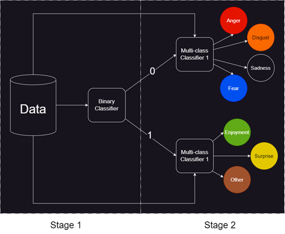

# Two-stage Ensemble Approach for Sentiment Analysis

## My Framework
I apply a two-stage ensemble approach for sentiment analysis including 7 classes on the dataset UIT-VSMEC. That dataset is the first dataset for sentiment analysis on Vietnamese comments published in 2019.
- __Stage 1__: Classify the comment as negative or not.
    - Group 1 (Negative): _Anger_, _Disgust_, _Sadness_ and _Fear_.
    - Group 2 (Not negative, can be postive or indistinct): _Enjoyment_, _Surprise_ and _Other_.
- __Stage 2__: If I know that comment is in group 1 or group 2, I will classify it into which class in the group.

Fig. below shows my framework.

  

## Experimental Results
After the experiment, my framework with `SVM + SVM + TextCNN` got the highest result with 50% __accuracy__, 1% higher than the baseline model. The `results/` folder contains all the results of each phased model as csv on both the validation set and the test set.

## Resource & References
- The dataset I got from __UIT-VSMEC__ can be accessed:
    * [Paper - Emotion Recognition for Vietnamese Social Media Text](https://arxiv.org/pdf/1911.09339.pdf) 
    * [Dataset](https://drive.google.com/drive/folders/1HooABJyrddVGzll7fgkJ6VzkG_XuWfRu?fbclid=IwAR1eL-CXsOBYeZHk7GCmBMvLniTtoHTq8oNSvjSErTUAVelbJPjRu4lrzzE)

- The __VNCoreNLP__ toolkit can be accessed:
    * [Paper - VnCoreNLP: A Vietnamese Natural Language Processing Toolkit](https://aclanthology.org/N18-5012.pdf)
    * [Github repo](https://github.com/vncorenlp/VnCoreNLP)

- The __Vietnamese stopwords__ list can be accessed:
    * [Github repo](https://github.com/stopwords/vietnamese-stopwords)

- The __PhoW2V (pre-trained W2V for vietnamese)__ can be accessed:
    * [Paper - PhoW2V: Pre-trained Word2Vec syllable and word embeddings for Vietnamese](https://aclanthology.org/2020.findings-emnlp.364.pdf)
    * [Github repo](https://github.com/datquocnguyen/PhoW2V)